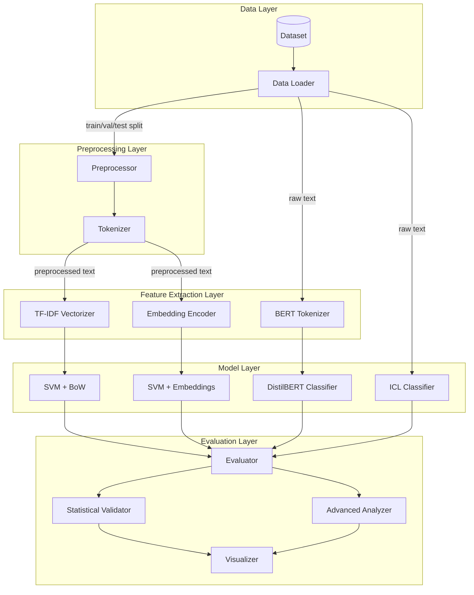

# Design Document: Sentiment Analysis NLP

## Overview

This document describes the architecture and design of the sentiment analysis system for product reviews. The system implements a complete NLP pipeline comparing four classification approaches: SVM with Bag of Words (TF-IDF), SVM with Word Embeddings, BERT (DistilBERT), and In-Context Learning as bonus.

The design prioritizes:
- **Simplicity**: Direct and fast solutions as per professor's guidance
- **Data Leakage Prevention**: Rigorous separation between train, validation, and test
- **Statistical Rigor**: Multiple simulations with significance testing
- **Reproducibility**: Documented code in Jupyter Notebook
- **Professional Visualizations**: Modern charts for presentation

## Architecture



## Components and Interfaces

### DataLoader

Responsible for loading and preparing the product reviews dataset.

```python
class DataLoader:
    """Loads and prepares product reviews dataset."""
    
    def __init__(self, dataset_name: str, test_size: float = 0.15, 
                 val_size: float = 0.15, random_state: int = 42):
        """
        Args:
            dataset_name: Dataset name (e.g., 'amazon_reviews')
            test_size: Test set proportion (default 15%)
            val_size: Validation set proportion (default 15%)
            random_state: Seed for reproducibility
        """
        pass
    
    def load(self) -> Tuple[pd.DataFrame, pd.DataFrame, pd.DataFrame]:
        """
        Loads dataset and returns train, validation, and test DataFrames.
        
        Returns:
            Tuple[train_df, val_df, test_df] with columns ['text', 'label']
        """
        pass
    
    def convert_rating_to_label(self, rating: int) -> Optional[int]:
        """
        Converts numeric rating to binary label.
        
        Args:
            rating: Rating from 1 to 5
            
        Returns:
            0 (negative) for 1-2, 1 (positive) for 4-5, None for 3
        """
        pass
    
    def get_class_distribution(self) -> Dict[str, Dict[str, int]]:
        """Returns class distribution in train, validation, and test sets."""
        pass
```

### Preprocessor

Cleans and normalizes texts for SVM models.

```python
class Preprocessor:
    """Preprocesses texts for traditional models (SVM)."""
    
    def __init__(self, language: str = 'english', remove_stopwords: bool = True):
        """
        Args:
            language: Language for stopwords
            remove_stopwords: Whether to remove stopwords
        """
        pass
    
    def fit(self, texts: List[str]) -> 'Preprocessor':
        """
        Fits preprocessor on training set.
        
        Args:
            texts: List of training texts
            
        Returns:
            self for chaining
        """
        pass
    
    def transform(self, texts: List[str]) -> List[str]:
        """
        Transforms texts using learned parameters.
        
        Args:
            texts: List of texts
            
        Returns:
            List of preprocessed texts
        """
        pass
```

### BoWVectorizer

Converts texts to TF-IDF vectors.

```python
class BoWVectorizer:
    """Vectorizes texts using TF-IDF."""
    
    def __init__(self, max_features: int = 5000, ngram_range: Tuple[int, int] = (1, 2)):
        """
        Args:
            max_features: Maximum number of features
            ngram_range: N-gram range (unigrams and bigrams)
        """
        pass
    
    def fit(self, texts: List[str]) -> 'BoWVectorizer':
        """Fits vocabulary on training set."""
        pass
    
    def transform(self, texts: List[str]) -> scipy.sparse.csr_matrix:
        """Transforms texts to sparse TF-IDF matrix."""
        pass
```

### EmbeddingEncoder

Converts texts to average embedding vectors.

```python
class EmbeddingEncoder:
    """Encodes texts using pre-trained embeddings."""
    
    def __init__(self, model_name: str = 'glove-wiki-gigaword-100'):
        """
        Args:
            model_name: Embedding model name (gensim)
        """
        pass
    
    def encode(self, text: str) -> np.ndarray:
        """
        Encodes text as mean vector of word embeddings.
        
        Args:
            text: Tokenized text
            
        Returns:
            Mean embedding vector
        """
        pass
    
    def encode_batch(self, texts: List[str]) -> np.ndarray:
        """Encodes batch of texts."""
        pass
```

### SVMClassifier

SVM classifier wrapper.

```python
class SVMClassifier:
    """SVM classifier with configurable kernel."""
    
    def __init__(self, kernel: str = 'linear', C: float = 1.0, gamma: str = 'scale'):
        """
        Args:
            kernel: 'linear' for BoW, 'rbf' for embeddings
            C: Regularization parameter
            gamma: Kernel coefficient for RBF
        """
        pass
    
    def fit(self, X: np.ndarray, y: np.ndarray) -> 'SVMClassifier':
        """Trains SVM on training set."""
        pass
    
    def predict(self, X: np.ndarray) -> np.ndarray:
        """Predicts labels for new data."""
        pass
```

### BERTClassifier

DistilBERT-based classifier.

```python
class BERTClassifier:
    """Sentiment classifier using DistilBERT."""
    
    def __init__(
        self, 
        model_name: str = 'distilbert-base-uncased',
        max_length: int = 512,
        batch_size: int = 16,
        learning_rate: float = 2e-5,
        num_epochs: int = 3
    ):
        pass
    
    def tokenize(self, texts: List[str]) -> Dict[str, torch.Tensor]:
        """Tokenizes texts using BERT tokenizer."""
        pass
    
    def fit(
        self, 
        train_texts: List[str], 
        train_labels: List[int],
        val_texts: List[str],
        val_labels: List[int]
    ) -> 'BERTClassifier':
        """Fine-tunes BERT with early stopping on validation set."""
        pass
    
    def predict(self, texts: List[str]) -> np.ndarray:
        """Predicts labels for new texts."""
        pass
```

### ICLClassifier

In-Context Learning classifier.

```python
class ICLClassifier:
    """Classifier using In-Context Learning with LLM."""
    
    def __init__(
        self, 
        api_key: str,
        model: str = 'gpt-3.5-turbo',
        num_examples: int = 5
    ):
        pass
    
    def build_prompt(self, text: str, examples: List[Tuple[str, str]]) -> str:
        """Builds few-shot prompt with strategic examples."""
        pass
    
    def classify(self, text: str) -> str:
        """Classifies a single text using ICL."""
        pass
    
    def classify_batch(self, texts: List[str], sample_size: int = 100) -> List[str]:
        """Classifies sample of texts."""
        pass
```

### StatisticalValidator

Performs statistical significance tests.

```python
class StatisticalValidator:
    """Statistical validation for model comparison."""
    
    def __init__(self, alpha: float = 0.05):
        """
        Args:
            alpha: Significance level (default 0.05 for 95% confidence)
        """
        self.alpha = alpha
        
    def load_simulations(self, model_name: str) -> pd.DataFrame:
        """Loads results from multiple simulations."""
        pass
    
    def shapiro_normality(self, model_name: str, metric: str) -> Dict:
        """Shapiro-Wilk normality test."""
        pass
    
    def kruskal_wallis_multiple(self, model_names: List[str], metric: str) -> Dict:
        """Kruskal-Wallis H-test for multiple groups."""
        pass
    
    def wilcoxon_pairwise(self, model1: str, model2: str, metric: str) -> Dict:
        """Wilcoxon Signed-Rank test for paired comparison."""
        pass
    
    def generate_pvalue_matrix(self, model_names: List[str], metric: str) -> np.ndarray:
        """Generates p-value matrix for all model pairs."""
        pass
    
    def generate_report(self, model_names: List[str], metrics: List[str]) -> str:
        """Generates complete statistical report."""
        pass
```

### AdvancedNLPAnalysis

Advanced NLP-specific analyses.

```python
class AdvancedNLPAnalysis:
    """Advanced NLP-specific analyses."""
    
    def __init__(self, test_df: pd.DataFrame, predictions_dict: Dict[str, np.ndarray]):
        """
        Args:
            test_df: DataFrame with ['text', 'label', 'length', 'has_emoji', etc.]
            predictions_dict: {'model_name': [predictions]}
        """
        pass
    
    def analyze_length_vs_accuracy(self) -> pd.DataFrame:
        """Analyzes relationship between text length and accuracy."""
        pass
    
    def analyze_typo_robustness(self, perturbed_predictions: Dict) -> pd.DataFrame:
        """Compares performance on clean vs perturbed text."""
        pass
    
    def analyze_emoji_impact(self) -> pd.DataFrame:
        """Analyzes impact of emojis on accuracy."""
        pass
    
    def analyze_sarcasm(self, sarcasm_indices: List[int]) -> pd.DataFrame:
        """Analyzes performance on sarcastic reviews."""
        pass
    
    def analyze_formality(self) -> pd.DataFrame:
        """Analyzes sensitivity to formality/dialect."""
        pass
```

### Evaluator

Calculates metrics and generates analyses.

```python
class Evaluator:
    """Evaluates and compares classifiers."""
    
    def __init__(self):
        self.results: Dict[str, Dict[str, float]] = {}
        self.confusion_matrices: Dict[str, np.ndarray] = {}
        self.training_times: Dict[str, float] = {}
        self.inference_times: Dict[str, float] = {}
    
    def evaluate(
        self, 
        y_true: np.ndarray, 
        y_pred: np.ndarray, 
        model_name: str
    ) -> Dict[str, float]:
        """Evaluates predictions and stores results."""
        pass
    
    def get_confusion_matrix(self, y_true: np.ndarray, y_pred: np.ndarray) -> np.ndarray:
        """Calculates confusion matrix."""
        pass
    
    def get_comparison_table(self) -> pd.DataFrame:
        """Returns comparison table of all models with mean ± std."""
        pass
    
    def get_error_examples(
        self, 
        texts: List[str], 
        y_true: np.ndarray, 
        y_pred: np.ndarray,
        n_examples: int = 5
    ) -> pd.DataFrame:
        """Returns error examples for qualitative analysis."""
        pass
```

### Visualizer

Generates professional visualizations.

```python
class Visualizer:
    """Generates professional visualizations for presentation."""
    
    def __init__(self, style: str = 'seaborn-v0_8-whitegrid', figsize: Tuple[int, int] = (10, 6)):
        pass
    
    def plot_metrics_comparison(self, results: Dict, metrics: List[str]) -> plt.Figure:
        """Generates grouped bar chart comparing metrics."""
        pass
    
    def plot_confusion_matrix(self, cm: np.ndarray, model_name: str) -> plt.Figure:
        """Generates heatmap confusion matrix."""
        pass
    
    def plot_boxplots(self, simulations_df: pd.DataFrame, metric: str) -> plt.Figure:
        """Generates boxplots showing metric distribution across simulations."""
        pass
    
    def plot_line_evolution(self, simulations_df: pd.DataFrame, metric: str) -> plt.Figure:
        """Generates line plot showing metric evolution across simulations."""
        pass
    
    def plot_pvalue_matrix(self, matrix: np.ndarray, model_names: List[str]) -> plt.Figure:
        """Generates p-value significance matrix with color coding."""
        pass
    
    def plot_confidence_intervals(self, results: Dict, metric: str) -> plt.Figure:
        """Generates bar chart with 95% confidence intervals."""
        pass
    
    def save_all_figures(self, output_dir: str, dpi: int = 300) -> None:
        """Saves all figures in high resolution."""
        pass
```

## Data Models

```python
@dataclass
class Review:
    """Represents a product review."""
    text: str
    rating: int  # 1-5
    label: Optional[int] = None  # 0=negative, 1=positive, None=neutral

@dataclass
class SimulationResult:
    """Result from a single simulation run."""
    simulation_id: int
    model_name: str
    random_seed: int
    accuracy: float
    precision_macro: float
    recall_macro: float
    f1_macro: float
    f1_weighted: float
    training_time: float
    inference_time: float

@dataclass
class ExperimentConfig:
    """Experiment configuration."""
    dataset_name: str
    train_size: float = 0.70
    val_size: float = 0.15
    test_size: float = 0.15
    num_simulations: int = 10
    
    # SVM + BoW
    tfidf_max_features: int = 5000
    tfidf_ngram_range: Tuple[int, int] = (1, 2)
    svm_bow_kernel: str = 'linear'
    svm_bow_C: float = 1.0
    
    # SVM + Embeddings
    embedding_model: str = 'glove-wiki-gigaword-100'
    svm_emb_kernel: str = 'rbf'
    svm_emb_C: float = 1.0
    svm_emb_gamma: str = 'scale'
    
    # BERT
    bert_model: str = 'distilbert-base-uncased'
    bert_max_length: int = 512
    bert_batch_size: int = 16
    bert_epochs: int = 3
    bert_learning_rate: float = 2e-5
    
    # ICL
    icl_model: str = 'gpt-3.5-turbo'
    icl_num_examples: int = 5
    icl_sample_size: int = 100
```

## Correctness Properties

*A property is a characteristic or behavior that should hold true across all valid executions of a system—essentially, a formal statement about what the system should do.*

### Property 1: Label Conversion Correctness

*For any* rating value between 1 and 5, the conversion to binary label SHALL produce 0 (negative) for ratings 1-2, 1 (positive) for ratings 4-5, and None for rating 3. Additionally, after filtering, no items with rating 3 or label None SHALL remain in the dataset.

**Validates: Requirements 1.3, 1.4**

### Property 2: Train-Validation-Test Split Stratification

*For any* dataset split, the proportion of positive and negative labels in training, validation, and test sets SHALL be within 5% of each other, ensuring stratified sampling preserves class distribution across all splits.

**Validates: Requirements 1.5**

### Property 3: Preprocessing Lowercase Invariant

*For any* text processed by the Preprocessor, the output SHALL contain no uppercase ASCII characters (A-Z).

**Validates: Requirements 2.2**

### Property 4: Preprocessing Stopword Removal

*For any* text processed by the Preprocessor with stopword removal enabled, the output tokens SHALL not contain any word from the predefined stopword list.

**Validates: Requirements 2.4**

### Property 5: TF-IDF Vectorization Validity

*For any* text vectorized by BoW_Vectorizer, the resulting vector SHALL have the same dimension as the vocabulary size, and all values SHALL be non-negative floats.

**Validates: Requirements 3.2**

### Property 6: Vocabulary Consistency for Test Data

*For any* word in the test set that is not in the training vocabulary, the TF-IDF vectorizer SHALL assign a zero weight to that word (no new vocabulary entries created during transform).

**Validates: Requirements 3.3**

### Property 7: Embedding Average Correctness

*For any* text with N known words (in embedding vocabulary), the resulting document vector SHALL equal the element-wise mean of the N word embeddings. For texts with zero known words, the result SHALL be a zero vector.

**Validates: Requirements 4.2, 4.3**

### Property 8: BERT Tokenization Length Constraint

*For any* text tokenized by BERT_Classifier, the resulting input_ids tensor SHALL have length less than or equal to 512 tokens (max_length parameter).

**Validates: Requirements 5.3**

### Property 9: Metrics Range Validity

*For any* evaluation result, F1_Score and Accuracy SHALL be in the range [0.0, 1.0] inclusive.

**Validates: Requirements 3.5, 4.5, 5.7, 6.5**

### Property 10: Confusion Matrix Validity

*For any* confusion matrix generated, the sum of all elements SHALL equal the total number of test samples, and all elements SHALL be non-negative integers.

**Validates: Requirements 3.6, 4.6, 5.8**

### Property 11: Error Examples Correctness

*For any* example returned by get_error_examples(), the predicted label SHALL differ from the true label (y_pred != y_true).

**Validates: Requirements 9.8**

### Property 12: ICL Prompt Contains Examples

*For any* prompt built by ICL_Classifier.build_prompt(), the prompt string SHALL contain all provided few-shot example texts.

**Validates: Requirements 6.2**

### Property 13: Statistical Test P-Value Range

*For any* statistical test result (Wilcoxon, Kruskal-Wallis), the p-value SHALL be in the range [0.0, 1.0] inclusive.

**Validates: Requirements 7.4, 7.5**

### Property 14: Simulation Results Consistency

*For any* set of N simulations, the results DataFrame SHALL contain exactly N rows per model, and all metric values SHALL be valid floats (not NaN or Inf).

**Validates: Requirements 7.1, 7.2**

## Error Handling

### Data Loading Errors

| Error Condition | Handling Strategy |
|-----------------|-------------------|
| Dataset not found | Raise `DatasetNotFoundError` with download instructions |
| Empty dataset | Raise `EmptyDatasetError` |
| Missing columns (text/rating) | Raise `InvalidDataFormatError` with expected schema |
| Invalid rating values | Log warning and skip invalid rows |

### Preprocessing Errors

| Error Condition | Handling Strategy |
|-----------------|-------------------|
| Empty text after preprocessing | Return empty string, log warning |
| Encoding errors | Use `errors='ignore'` or replace with placeholder |
| Tokenization failure | Return empty list, log warning |

### Model Training Errors

| Error Condition | Handling Strategy |
|-----------------|-------------------|
| Insufficient training data | Raise `InsufficientDataError` (min 100 samples) |
| GPU out of memory (BERT) | Reduce batch size automatically, retry |
| Convergence failure (SVM) | Increase max_iter, log warning |
| NaN in embeddings | Replace with zero vector, log warning |

### API Errors (ICL)

| Error Condition | Handling Strategy |
|-----------------|-------------------|
| API rate limit | Implement exponential backoff with max 3 retries |
| API timeout | Retry with increased timeout, max 3 attempts |
| Invalid API key | Raise `APIAuthenticationError` |
| Unexpected response format | Log error, return None for that sample |

### Statistical Test Errors

| Error Condition | Handling Strategy |
|-----------------|-------------------|
| Insufficient samples for test | Log warning, skip test |
| Identical distributions | Return p-value = 1.0, log info |

## Testing Strategy

### Dual Testing Approach

The project uses two complementary testing approaches:

1. **Unit Tests**: Verify specific examples, edge cases, and error conditions
2. **Property-Based Tests**: Verify universal properties on randomly generated inputs

### Property-Based Testing Configuration

- **Library**: `hypothesis` (Python)
- **Minimum iterations**: 100 per property
- **Tag format**: `# Feature: sentiment-analysis-nlp, Property N: [property_text]`

### Test Organization

```
tests/
├── unit/
│   ├── test_data_loader.py
│   ├── test_preprocessor.py
│   ├── test_vectorizers.py
│   ├── test_classifiers.py
│   ├── test_evaluator.py
│   └── test_statistical_validator.py
├── property/
│   ├── test_label_conversion_props.py
│   ├── test_preprocessing_props.py
│   ├── test_vectorization_props.py
│   ├── test_embedding_props.py
│   ├── test_bert_props.py
│   ├── test_evaluation_props.py
│   └── test_statistical_props.py
└── integration/
    └── test_pipeline.py
```

### Property Test Examples

```python
from hypothesis import given, strategies as st, settings

# Feature: sentiment-analysis-nlp, Property 1: Label Conversion Correctness
@given(rating=st.integers(min_value=1, max_value=5))
@settings(max_examples=100)
def test_label_conversion_correctness(rating):
    """For any rating 1-5, conversion produces correct binary label."""
    label = convert_rating_to_label(rating)
    if rating <= 2:
        assert label == 0
    elif rating >= 4:
        assert label == 1
    else:
        assert label is None

# Feature: sentiment-analysis-nlp, Property 13: Statistical Test P-Value Range
@given(
    data1=st.lists(st.floats(min_value=0, max_value=1), min_size=10, max_size=50),
    data2=st.lists(st.floats(min_value=0, max_value=1), min_size=10, max_size=50)
)
@settings(max_examples=100)
def test_pvalue_range(data1, data2):
    """For any statistical test, p-value is in [0, 1]."""
    from scipy.stats import wilcoxon
    min_len = min(len(data1), len(data2))
    if min_len >= 10:
        _, p_value = wilcoxon(data1[:min_len], data2[:min_len])
        assert 0.0 <= p_value <= 1.0
```

## Project Structure

```
projeto_sentiment_nlp/
├── data/
│   ├── raw/                          # Original data
│   ├── processed/                    # Cleaned data
│   └── perturbed/                    # Dataset with typos
│
├── notebooks/
│   ├── 01_data_collection_eda.ipynb
│   ├── 02_model_training.ipynb
│   ├── 03_statistical_validation.ipynb
│   └── 04_advanced_analysis.ipynb
│
├── src/
│   ├── config.py
│   ├── data_loader.py
│   ├── preprocessor.py
│   ├── vectorizers.py
│   ├── embedding_encoder.py
│   ├── classifiers.py
│   ├── bert_classifier.py
│   ├── icl_classifier.py
│   ├── evaluator.py
│   ├── statistical_validator.py
│   ├── advanced_analysis.py
│   ├── visualizer.py
│   └── utils.py
│
├── results/
│   ├── simulations/                  # 10-30 simulations per model
│   ├── statistical_tests/
│   ├── advanced_analysis/
│   └── plots/
│
├── tests/
│   ├── unit/
│   ├── property/
│   └── integration/
│
├── requirements.txt
└── README.md
```

## Dependencies

```
# Core
pandas>=1.5.0
numpy>=1.23.0
matplotlib>=3.6.0
seaborn>=0.12.0

# NLP Classic
scikit-learn>=1.2.0
nltk>=3.8
gensim>=4.3.0

# BERT
transformers>=4.35.0
torch>=2.0.0
datasets>=2.14.0
accelerate>=0.24.0

# LLM APIs
openai>=1.3.0

# Statistics
scipy>=1.10.0
statsmodels>=0.14.0

# Text Perturbation
nlpaug>=1.1.11

# Emoji Detection
emoji>=2.8.0

# Testing
hypothesis>=6.0.0
pytest>=7.0.0

# Utilities
tqdm>=4.66.0
joblib>=1.3.0
```
